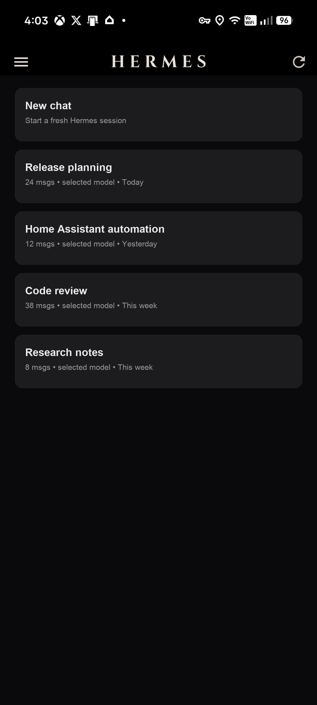
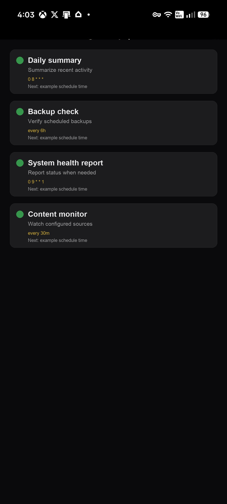
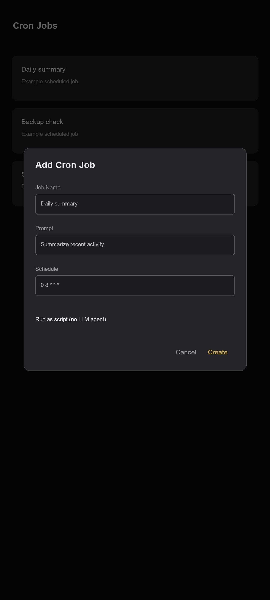
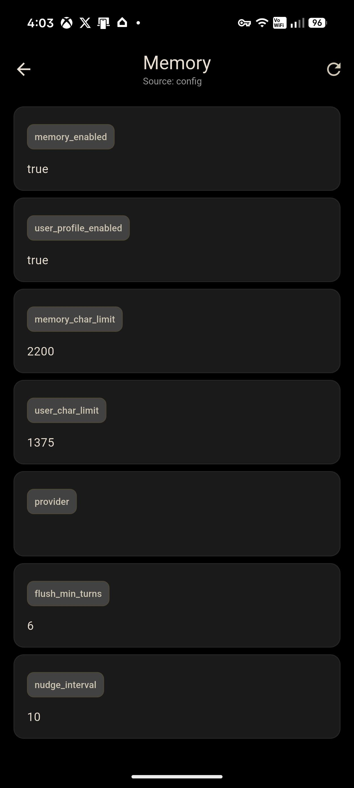
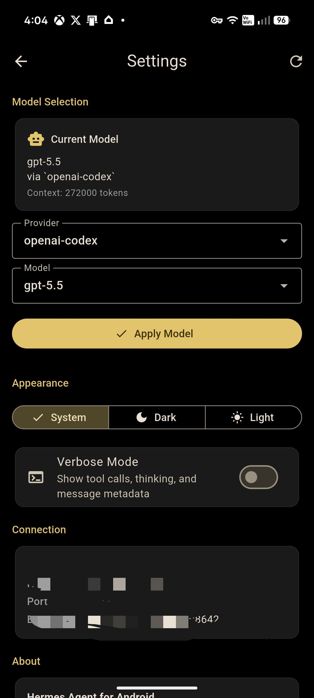
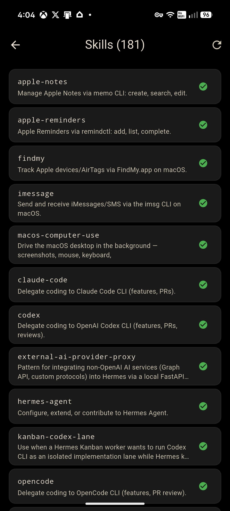

# Hermes Android — v2.1.0

Android client for [Hermes Agent](https://hermes-agent.nousresearch.com/) — chat with your Hermes sessions from a phone or tablet over local Wi-Fi or a private Tailscale network.

> **v2.0.0** merges the community Remote Gateway edition contributed by
> [@CristianGCiocoi](https://github.com/CristianGCiocoi), with review and
> testing from [@AI-Guru](https://github.com/AI-Guru) and
> [@grunjol](https://github.com/grunjol). The merge brings a unified Desktop
> Gateway JSON-RPC transport, per-chat model selection, multi-attachment uploads,
> durable turn recovery, voice dictation, and a comprehensive test suite.
> See [CHANGELOG.md](CHANGELOG.md) for the full list and the
> [merge PR thread](https://github.com/rusty4444/hermes-android/issues/81) for
> the community discussion.

## Current release

- Version: **2.1.0** (build 2140)
- Package: `com.hermesagent.hermes_android`
- Recommended APK for modern phones: ARM64 release build from the
  [Releases](https://github.com/rusty4444/hermes-android/releases) page.
- Production builds are signed with a private release keystore. Debug APKs
  signed with the Android debug certificate remain available for testing
  under the `com.hermesagent.hermes_android.dev` package ID.
- Previous upstream releases remain available from the
  [Releases](https://github.com/rusty4444/hermes-android/releases) page.

## Remote Gateway edition highlights

- One Desktop Gateway JSON-RPC session for text, images, and files.
- Copy/select text, Read aloud, Stop, Edit and resend, Regenerate, and export.
- Up to 10 Remote Gateway attachments per draft, capped at 64 MiB total;
  generic files retain the 16 MiB per-file limit.
- File-backed app cache, metadata-sanitized JPEG/PNG/WebP images, ordered
  sequential upload, accessible reordering, remove, and individual retry.
  Sanitized JPEG inputs remain JPEG; PNG and WebP inputs are emitted as PNG.
- Legacy REST remains fail-closed to one image and does not expose multi-select.
- Per-chat model and thinking effort without changing the profile default.
- Search, Rename, Branch, and Delete for remote conversations.
- Native approval, sudo/secret, clarification, reasoning, tool activity,
  notifications, background results, reviews, and subagent status.
- Persistent reconnect/session resume and defensive retry handling.
- **Background turn notifications** — Android notifications fire when a
  gateway turn completes while the app is backgrounded, mirroring the
  Hermes Desktop tray notification behaviour. Notifications are
  automatically cleared when returning to the app.

### Gateway transport compatibility

Stock Hermes Agent releases do not currently advertise the experimental
`capabilities.turn_recovery` contract in `gateway.ready`. Against those releases,
the app intentionally uses the legacy Desktop Gateway transport and displays
**Background recovery unavailable — legacy transport**. If a legacy turn finishes
while Android is backgrounded, the app re-syncs that session's server-side
history on resume. The durable exactly-once recovery path activates only when a
gateway explicitly advertises the compatible recovery contract.

See [CHANGELOG.md](CHANGELOG.md) for the complete `.13` change list and
[docs/HERMESAPK_DEVELOPMENT_LOG.md](docs/HERMESAPK_DEVELOPMENT_LOG.md) for the
sanitized implementation and validation record.

## What's new in v2.1.0

v2.1.0 merges the community daily-driver workspace edition from
[@CarlosReyesPena](https://github.com/CarlosReyesPena) (PR #88): a new
Workspace home with Projects, Chats and Activity panes, server-backed session
search, config backup and restore, and quick-chat intents — plus a large
accompanying test suite (900+ tests).

- **Workspace shell** — a new Home with attention-ranked "needs you" digest,
  global New (project or quick) chat button, Activity operational timeline of
  gateway turns, and a More pane that routes Cron, Skills, Memory, Settings
  and the Hermes dashboard.
- **Projects pane** — server-owned Hermes projects via the gateway
  `projects.*` RPC family: project tree overview, per-project chats,
  migration preview and write path for local Spaces, chat moves between
  projects, per-project search, and safe deletion. Legacy gateways degrade
  gracefully to a labelled local-only compatibility mode.
- **Chats browser** — All / Recent / Unassigned / Archived filters, date
  grouping, running/done status, pinned and archived session flags, and a
  session→project label fallback for older APIs.
- **Session search** — three selectable modes: on-device (default), full-text
  via the dashboard FTS5 endpoint with matching-excerpt results, and
  AI-assisted query rewriting through Hermes (requires the corresponding
  server support). Mode is remembered per connection; provider API keys never
  leave the server.
- **Configuration backup & restore** — export all connections and app
  preferences to a single encrypted file (PBKDF2 + AES-256-GCM), import in
  merge or replace mode, with restore reachable from the empty-connection
  state before any server is configured.
- **Quick chat lifecycle** — share-target and app-shortcut entry points,
  share/review sheets for text and files, and a 72-hour quick-chat archive
  policy that never archives blocked or running work.
- **Resilience** — gateway capability discovery (never assume the newest
  server), fresh TCP per request with a 20 s timeout to fix stale keep-alive
  hangs, and runtime Android 13+ notification permission request.
- **Chat UI** — sticky context header (project, model, reasoning effort,
  connection state), You/Hermes role labels, long-press action sheet, real
  fenced code blocks with copy and wrap/scroll toggle, and full tool output
  on expanded activity cards.

## What's new in v2.0.1

- **Background turn notifications** — Android notifications fire when a Desktop
  Gateway turn completes while the app is backgrounded, mirroring Hermes Desktop
  tray notification behaviour. Notifications are automatically cleared when you
  return to the app.
- **Scroll bug resolved** — the inherited mid-history scroll-jump on session
  reopen (from upstream PR #71) has been fully resolved. The
  `ChatScrollCoordinator` only aligns to the end on initial load, never inside
  the streaming completion handler.

## What's new in v2.0.0

v2.0.0 merges the community Remote Gateway edition from
[@CristianGCiocoi](https://github.com/CristianGCiocoi).

- **Unified Desktop Gateway JSON-RPC transport** — text, images, and files share
  one WebSocket session instead of split REST+WebSocket paths.
- **Per-chat model and thinking-effort selection** without changing the profile
  default.
- **Multi-attachment uploads** — up to 10 files per message, 16 MiB each.
- **Copy/Select, Read Aloud, Edit+Resend, Regenerate, Stop, Export, Search,
  Rename, Branch, Delete** for conversations.
- **Native Desktop Gateway event handling** — approvals, sudo, secrets,
  clarifications, reasoning, tool activity, notifications, background results,
  reviews, and subagents.
- **Voice dictation** — stage voice input before explicit send.
- **Durable turn recovery** — completed gateway responses survive Android
  process-kill lifecycle events.
- **Persistent accessible text size** setting.
- **ATLAS document intake metadata** for mobile uploads.
- **Secure Android credential storage** with platform key material.
- **113+ Flutter tests** plus a synthetic gateway contract suite under
  `tools/fake_gateway/`.

## What's new in v1.0.8

- **Reverse-proxy path prefixes** — configure separate path prefixes for the Gateway API and dashboard, e.g. `/profile/peter` before `/api` and `/v1`, and `/dashboard` before dashboard `/api` routes.
- **Proxied dashboard mode** — enable **Dashboard behind proxy** when nginx/Caddy/your host injects dashboard authentication. In this mode the app sends clean dashboard requests without trying to scrape a dashboard session token or perform password login.
- **Prefix-aware validation and chat** — API-key validation, session browsing, existing chat history, streaming chat completions, and dashboard drawer screens all use the configured prefixes.

## What's new in v1.0.7

- **Password-protected dashboards** — the Memory/Cron/Skills/Settings tabs now work against a dashboard secured with basic-auth, not just an open (`--insecure`) one. The app logs in via the dashboard's `/auth/password-login` flow and reuses the session cookie (the same mechanism the desktop client uses).
- **Configurable dashboard port** — set a custom dashboard port per connection when it isn't the default `9119`.
- **Dashboard details in the connection flow** — set the dashboard port/username/password while adding a connection (expand **Custom dashboard details**) or later via **⋮ → Dashboard Login**, with validation before saving.

## What's new in v1.0.6

- **Voice chat support** — tap the microphone in chat to dictate a message to Hermes, and Hermes can speak the response back.
- Spoken replies can be toggled from the chat input bar.
- Android/iOS microphone and speech-recognition permissions are included.

## Features

- **Hermes chat on Android** — browse sessions, create new chats, and send prompts to your Hermes Agent.
- **Streaming responses** — chat uses the Hermes Gateway OpenAI-compatible streaming endpoint: `POST /v1/chat/completions`. Tokens appear in real-time with smooth auto-scroll.
- **Messaging-style UI** — dark/light/system themes, gold Hermes accent color (`#D4AF37`), markdown rendering, relative timestamps, and responsive phone/tablet layouts.
- **Gold/black Hermes branding** — distinctive gold accent on black background, custom app icon with mipmap densities, agent messages use grey bubbles.
- **Gateway API integration** — sessions and chat run through the Hermes Gateway API Server, normally on port `8642`, with HTTP and HTTPS endpoints supported. Reverse-proxy deployments can set a gateway path prefix that is applied before `/api` and `/v1` routes.
- **Dashboard integrations** — Memory, Cron Jobs, Skills, and Settings screens use the Hermes dashboard API (default port `9119`, configurable per connection) on the same host. Works with open (`--insecure`) dashboards, **password-protected dashboards** via the built-in login, and proxied dashboards where auth is injected upstream.
- **Model settings** — view and change the configured Hermes model where the dashboard exposes model settings.
- **Cron management** — list, trigger, pause/resume, create, edit, and delete scheduled Hermes cron jobs.
- **Skills browser** — view available Hermes skills with descriptions and trigger conditions.
- **Memory viewer** — inspect conversation memory across sessions.
- **Verbose mode toggle** — show raw message metadata (role, tool calls, timestamps) in chat.
- **Three-way theme toggle** — Dark / Light / System default.
- **Keyboard handling** — auto-scroll on keyboard open, send action on Enter, FAB to scroll to bottom.
- **Voice chat** — microphone dictation sends recognised speech to Hermes, with optional text-to-speech replies.

## Screenshots

<table>
  <tr>
    <td align="center"><br><sub>Session list</sub></td>
    <td align="center"><br><sub>Navigation drawer</sub></td>
    <td align="center"><br><sub>Cron jobs</sub></td>
  </tr>
  <tr>
    <td align="center"><br><sub>Add cron job</sub></td>
    <td align="center"><br><sub>Memory</sub></td>
    <td align="center"><br><sub>Settings</sub></td>
  </tr>
  <tr>
    <td align="center"><br><sub>Skills</sub></td>
  </tr>
</table>

## Quick start

### Prerequisites

- Android device or emulator (Android 8+).
- Hermes Agent installed on the host machine.
- Hermes Gateway API Server reachable from the Android device.
- `API_SERVER_KEY` from the Hermes host environment (`~/.hermes/.env`).
- Optional: Hermes dashboard reachable for Memory/Cron/Skills/Settings screens.

Hermes Agent docs: <https://hermes-agent.nousresearch.com/docs>

### Install the APK

Download the latest APK from this repository's
[GitHub Releases](https://github.com/rusty4444/hermes-android/releases) page.

For most Android phones, install the ARM64 APK:

```bash
adb install Hermes-Android-2.0.1-arm64-release.apk
```

If sideloading directly on Android, enable **Install unknown apps** for your browser or file manager, then open the downloaded APK.

### 1. Start the Gateway API Server

The Android chat/session features connect to the Hermes Gateway API Server. It must bind to an address your phone can reach, not only `127.0.0.1`.

Use your normal Hermes gateway/API-server startup command and confirm:

- host/IP is reachable from Android
- port is usually `8642`
- `API_SERVER_KEY` is available in `~/.hermes/.env`

### 2. Optional: start the dashboard for drawer features

Memory, Cron Jobs, Skills, and Settings use the Hermes dashboard API (default port `9119`).

Open dashboard (no login):

```bash
hermes dashboard --insecure --host 0.0.0.0 --tui --port 9119
```

Password-protected dashboard (recommended on shared networks) — start it with a
basic-auth provider instead of `--insecure`, then enter the username/password in
the app's **Dashboard / Proxy Settings** dialog (see [Dashboard access](#4-optional-configure-dashboard-access)).

> `--host 0.0.0.0` is required when connecting from another device. A localhost-only dashboard cannot be reached from Android.

### 3. Connect the app

1. Put the Android device and Hermes host on the same Wi-Fi/LAN (or connect via Tailscale — see below).
2. Find the Hermes host IP:

   ```bash
   # macOS
   ipconfig getifaddr en0

   # Linux
   hostname -I | awk '{print $1}'
   ```

3. Open the Hermes Android app.
4. Tap **+** to add a connection.
5. Enter:
   - **Label:** any name, e.g. `Home`
   - **Host:** the host IP, e.g. `192.168.1.50`
   - **Port:** `8642`
   - **API Key:** `API_SERVER_KEY` from the Hermes machine
6. If your deployment is behind a reverse proxy path, expand **Custom proxy and dashboard details** and set the gateway/dashboard prefixes there. Do not put URL paths in the Host field; the Host field is just the scheme, hostname, and optional port.
7. Tap the saved connection to browse sessions.
8. Tap a session to start chatting, or create a new one.

### 4. Optional: configure dashboard access

The drawer screens (Memory, Cron Jobs, Skills, Settings) talk to the Hermes
dashboard, which can run on a different port from the Gateway API Server and may
be password-protected. Configure it per connection — either while adding the
connection (expand **Custom proxy and dashboard details** in the Add Connection dialog) or
afterwards:

1. On the connections list, tap the **⋮** menu on a connection → **Dashboard / Proxy Settings**.
2. Fill in:
   - **Gateway path prefix** — optional reverse-proxy path before gateway `/api`
     and `/v1` routes, e.g. `/profile/peter`.
   - **Dashboard path prefix** — optional reverse-proxy path before dashboard
     `/api` routes, e.g. `/dashboard`.
   - **Dashboard behind proxy** — enable this when the proxy injects dashboard
     authentication and the app should not fetch a dashboard SPA token or log in
     with username/password.
   - **Dashboard Port** — leave blank to use the default (`9119` for HTTP, or the
     same external port for HTTPS deployments), or set an explicit port if your
     dashboard is exposed elsewhere.
   - **Username / Password** — only for a password-protected dashboard. Leave
     both blank for an open (`--insecure`) dashboard.
3. Tap **Save**. The app validates the settings against the dashboard before
   storing them.

When credentials are set, the app authenticates via the dashboard's
`/auth/password-login` flow and reuses the returned session cookie — the same
mechanism the Hermes desktop client uses.

## Connect remotely with Tailscale

Tailscale gives your phone and Hermes machine a private encrypted network, so you do **not** need to expose Hermes directly to the public internet.

Tailscale website: <https://tailscale.com/>

### Install Tailscale on Android

1. Install Tailscale for Android: <https://tailscale.com/download/android>
2. Sign in with the same Tailscale account/tailnet used by your Hermes machine.
3. Leave Tailscale connected while using the Hermes app.

### Install Tailscale on the Hermes machine

Install Tailscale for your OS: <https://tailscale.com/download>

Examples:

```bash
# macOS with Homebrew
brew install --cask tailscale

# Debian/Ubuntu
curl -fsSL https://tailscale.com/install.sh | sh
sudo tailscale up
```

After the Hermes machine is connected, get its Tailscale address:

```bash
tailscale ip -4
```

You can also enable MagicDNS and use the machine name instead of the `100.x.y.z` IP:

- MagicDNS docs: <https://tailscale.com/kb/1081/magicdns>

### Connect the app over Tailscale

In the Android app connection dialog:

- **Host:** the Hermes machine Tailscale IP, e.g. `100.64.12.34`, or its MagicDNS name
- **Port:** `8642`
- **API Key:** `API_SERVER_KEY`

If using Memory/Cron/Skills/Settings remotely, keep the dashboard reachable on the same Tailscale host at port `9119`.

## Connect over HTTPS

For hosted/reverse-proxy deployments (e.g., Hugging Face Spaces, VPS with nginx/Caddy), enter the full HTTPS URL in the **Host** field:

```text
https://your-hermes-host.example.com
```

If no port is included, the app uses port `443`. If your HTTPS service uses a custom port, either include it in the URL (`https://host.example.com:8443`) or set the Port field to that value before connecting.

For HTTPS connections, dashboard drawer screens use the same external HTTPS port. For local HTTP/LAN connections, chat uses port `8642` and dashboard screens use port `9119`.

### Reverse-proxy paths

If your proxy exposes Hermes under URL paths, keep the **Host** field to the origin only and put paths in **Custom proxy and dashboard details**:

```text
Host: https://your-hermes-host.example.com
Port: 443
Gateway path prefix: /profile/peter
Dashboard path prefix: /dashboard
Dashboard behind proxy: on, if the proxy injects dashboard auth
```

With that setup, the app calls gateway routes such as
`https://your-hermes-host.example.com/profile/peter/v1/chat/completions` and
dashboard routes such as
`https://your-hermes-host.example.com/dashboard/api/model/info`.

### Security notes

- Prefer Tailscale/VPN for remote use.
- Do not port-forward the Gateway API Server or dashboard directly to the public internet.
- Rotate `API_SERVER_KEY` if it is shared or exposed.
- Local/Tailscale examples use HTTP, so the private network boundary matters. Use HTTPS for public or hosted endpoints.

## Architecture

```text
Android app (Flutter)
├─ Gateway API Server, port 8642 or HTTPS proxy prefix
│  ├─ GET /api/sessions
│  ├─ GET /api/sessions/{id}/messages
│  └─ POST /v1/chat/completions  (SSE streaming)
└─ Hermes dashboard, port 9119 or HTTPS proxy prefix
   ├─ /api/memory
   ├─ /api/cron/jobs
   ├─ /api/skills
   └─ /api/model/*
```

## Using the app

### Chat screen

- **Send messages** — Type in the input field and tap the send button or press Enter.
- **Streaming responses** — The agent's response appears token-by-token in real-time. The chat auto-scrolls to the bottom as new tokens arrive.
- **Tool progress** — When the agent uses tools, inline progress messages show the tool name, status, and progress.
- **Verbose mode** — Toggle in the app settings to show raw message metadata (role, tool call IDs, timestamps).
- **Markdown rendering** — Assistant messages render markdown (code blocks, tables, lists, links).
- **Relative timestamps** — Messages show "2m ago", "3h ago", etc.

### Voice chat

The chat input bar has two voice controls:

| Button | Icon | What it does |
|--------|------|-------------|
| **Mic** | 🎤 / 🎤🔴 | Tap to start voice dictation. Speak your message — it appears in the input field and sends automatically when you pause. Tap again (or the red stop icon) to cancel. |
| **Voice reply toggle** | 🔊 / 🔇 | Toggles whether Hermes reads its response aloud after a voice-input message. On = 🔊 (volume up), Off = 🔇 (volume off). |

**How voice replies work:**

1. Tap the mic, speak your question, and wait for the recognition to finish (the text appears and auto-sends).
2. Hermes streams its response as text in the chat as usual.
3. After the full response arrives, if the voice reply toggle is on (🔊), the app reads the response aloud using text-to-speech.

Voice replies **only** trigger when you send a message via the mic button. Typed messages produce text responses only.

#### Setting up text-to-speech (Android)

Spoken replies require Google Text-to-Speech to be installed and configured on your device. The app uses the device's built-in TTS engine — it does not bundle its own voices.

**Step-by-step:**

1. **Install Google Text-to-Speech** — If not already on your device, install from the Play Store: [Google Text-to-Speech](https://play.google.com/store/apps/details?id=com.google.android.tts)
2. **Set as default engine** — Settings → Accessibility → Text-to-speech output → Preferred engine → **Google Text-to-Speech**
3. **Download voice data** — In the same TTS settings screen, tap the gear icon ⚙️ next to Google Text-to-Speech → Install voice data → select **English (Australia)** or your preferred English voice → download
4. **Check media volume** — TTS uses the **media** audio stream, not the ringer. Turn up media volume and make sure your phone isn't in silent/vibrate-only mode.
5. **Test TTS** — In the TTS settings screen, tap "Play" to hear a test phrase. If you hear it, the app should work.

**Troubleshooting voice:**

- **Mic button does nothing** — Speech recognition may be unavailable on your device. Ensure Google app is installed and has microphone permission.
- **Voice reply toggle is on (🔊) but Hermes doesn't speak** — Google TTS is likely not installed or has no voice data downloaded. Follow the TTS setup steps above.
- **Hermes speaks quietly or too fast** — Adjust speech rate and volume in Settings → Accessibility → Text-to-speech output.
- **Recognition is inaccurate** — Speak clearly, reduce background noise, and check that the device's system language includes English.

### Session list

- Browse all Hermes sessions.
- Tap a session to open its chat.
- Pull to refresh the session list.
- Create a new session from the session list header.

### Navigation drawer (☰)

Access these dashboard-powered screens:

- **Memory** — View conversation memory across sessions. Shows stored facts, preferences, and project context.
- **Cron Jobs** — List all scheduled cron jobs. Trigger, pause/resume, create, edit, or delete jobs.
- **Skills** — Browse available Hermes skills with descriptions and trigger conditions.
- **Settings** — View and change the configured Hermes model, theme preference, and verbose mode.

### Theme

- Three-way toggle: **Dark** / **Light** / **System default**.
- Gold Hermes accent (`#D4AF37`) on dark mode; adapted for light mode.

### Cron job management

The Cron Jobs screen supports full CRUD:

- **List** — See all jobs with status (enabled/disabled), next run, and schedule.
- **Create** — Tap **+** to add a new job with schedule (cron expression or interval), prompt, and optional skills.
- **Edit** — Tap a job to modify its schedule, prompt, skills, or status.
- **Trigger** — Manually run a job immediately.
- **Pause/Resume** — Toggle job enabled state.
- **Delete** — Remove a job (with confirmation).

## Development

```bash
cd hermes-android
flutter pub get
flutter analyze
flutter test
flutter run -d android
```

## Build release APKs

```bash
flutter clean
flutter pub get
flutter build apk --release --split-per-abi
mkdir -p release-apks
cp build/app/outputs/flutter-apk/app-*-release.apk release-apks/
```

`pubspec.yaml` declares the base Android `versionCode`. The F-Droid ABI-split
block in `android/app/build.gradle.kts` derives per-ABI codes as
`base * 10 + ABI code` (armeabi-v7a = 1, arm64-v8a = 2, x86_64 = 3), so the
codes stay ordered armeabi-v7a < arm64-v8a < x86_64 as fdroiddata requires.
For v2.1.0, base `2140` therefore produces codes `21401`/`21402`/`21403`.
CI reads the completed arm64 APK with `aapt` and fails if that relationship
drifts. Release-floor checks continue to apply to the base value and must not
be weakened to rely on the ABI code.

Output files:

```text
build/app/outputs/flutter-apk/app-arm64-v8a-release.apk
build/app/outputs/flutter-apk/app-armeabi-v7a-release.apk
build/app/outputs/flutter-apk/app-x86_64-release.apk
```

## Release checklist

Every release PR must complete [`CODE_QUALITY_CHECKLIST.md`](CODE_QUALITY_CHECKLIST.md) before tagging or publishing APKs. The checklist covers analysis, architecture, UX, security, release, and manual smoke-test checks.

Minimum release flow:

1. Update `pubspec.yaml` version.
2. Complete `CODE_QUALITY_CHECKLIST.md` and record any exceptions in the release PR.
3. Build split release APKs.
4. Tag the release, e.g. `v1.0.0`.
5. Create a GitHub Release with all APK assets.
6. Confirm the repository visibility and release assets on GitHub.

## Troubleshooting

### I can see sessions but dashboard drawer screens fail

Chat/session features use port `8642`. Memory, Cron Jobs, Skills, and Settings use the dashboard on port `9119`. Start the dashboard with `--host 0.0.0.0` and make sure port `9119` is reachable over Wi-Fi or Tailscale.

### Chat fails with an auth error

Check that the Android connection's API key matches `API_SERVER_KEY` from the Hermes machine (`~/.hermes/.env`).

### The app cannot find the host

- Verify phone and host are on the same Wi-Fi or same Tailscale tailnet.
- Try the raw IP before a hostname.
- Check local firewall rules for ports `8642` and `9119`.
- On Android, ensure the app has network permission (granted by default).

### Streaming stops or messages don't appear

- The SSE connection may have timed out. Pull to refresh the session list and re-enter the chat.
- Check that the Gateway API Server is running and responsive: `curl http://<host>:8642/api/sessions`.
- If using a reverse proxy, ensure it supports long-lived SSE connections (no aggressive timeouts).

### Dashboard screens show empty or error

- Verify the dashboard is running with `--host 0.0.0.0` (an open dashboard also needs `--insecure`).
- If the dashboard is password-protected, set the username/password under **⋮ → Dashboard / Proxy Settings** (or **Custom proxy and dashboard details** when adding the connection). A 401 here means the credentials are wrong.
- If the dashboard sits behind a reverse-proxy path, set **Dashboard path prefix**. If the proxy injects dashboard auth, enable **Dashboard behind proxy** so the app sends clean requests.
- Check the dashboard port matches the connection (default `9119` for local/Tailscale, same HTTPS port for hosted; override it in Dashboard / Proxy Settings if needed).
- The dashboard must be on the same host as the Gateway API Server for the app's drawer to reach it.

### Voice dictation or spoken replies aren't working

- **Spoken replies not working** — Install Google Text-to-Speech, set it as the default engine, and download English voice data. See [Setting up text-to-speech](#setting-up-text-to-speech-android) above for step-by-step instructions.
- **Speech recognition not working** — Ensure the Google app is installed and has microphone permission (Settings → Apps → Hermes → Permissions → Microphone).
- **Voice reply toggle is off** — Check the speaker icon in the chat input bar: 🔊 = on, 🔇 = off. Tap it to enable spoken replies.
- **Media volume is zero** — TTS uses the media audio stream, not the ringer. Turn up media volume with the physical volume buttons while on the home screen.
- **Hermes speaks but audio is quiet or fast** — Adjust speech rate and volume in Settings → Accessibility → Text-to-speech output.

### Host field examples

The app accepts any of these forms and normalizes them when saving:

```text
192.168.1.50
192.168.1.50:8642
http://192.168.1.50:8642
100.64.12.34
hermes-machine.tailnet-name.ts.net
https://your-hermes-host.example.com
https://your-hermes-host.example.com:8443
```

For hosted paths such as `https://your-hermes-host.example.com/profile/peter`, enter `https://your-hermes-host.example.com` as the host and `/profile/peter` as the **Gateway path prefix**.

## Project structure

```text
lib/
├── main.dart                          # App shell, saved connections, navigation drawer
├── core/
│   ├── models/
│   │   ├── attachment_draft.dart       # File-backed image/file composer model
│   │   ├── connection.dart             # SavedConnection model and host normalization
│   │   └── session.dart                # Session model
│   ├── screens/
│   │   ├── session_list_screen.dart   # Session browser
│   │   ├── chat_screen.dart           # Chat with SSE streaming
│   │   ├── settings_screen.dart       # Model/theme/app settings
│   │   ├── memory_screen.dart         # Memory viewer
│   │   ├── skills_screen.dart         # Skills browser
│   │   └── cron_screen.dart           # Cron job manager
│   ├── services/
│   │   ├── attachment_draft_service.dart # Cache, sanitization, limits, upload order
│   │   ├── connection_manager.dart    # Saved connections, Gateway API, Dashboard API
│   │   └── ws_client.dart             # JSON-RPC WebSocket client for future dashboard/TUI use
│   └── utils/
│       └── responsive.dart            # Phone/tablet breakpoints
└── assets/
    └── icon/
        └── icon.png                   # App icon source
```

## Credits

- **CarlosReyesPena** — community daily-driver workspace edition (PR #88): Workspace shell with Home/Projects/Chats/Activity/More, gateway projects integration, three-mode session search (on-device / FTS5 full-text / AI-assisted), encrypted config backup & restore, quick-chat lifecycle and share intents, capability discovery, and 900+ tests. Merged in v2.1.0.
- **CristianGCiocoi** — community Remote Gateway edition: unified JSON-RPC transport, per-chat model selection, multi-attachment uploads, durable turn recovery, voice dictation, gateway contract test suite, and the comprehensive CHANGELOG. Merged in v2.0.0.
- **AI-Guru** — detailed review, independent testing, and scroll-offset bug identification for the community edition.
- **grunjol** — technical review and transport-architecture feedback for the community edition; also contributed PR #68: reverse-proxy path prefix and proxied dashboard support.
- **louquillio** — contributed PR #74: session source filters in Settings.
- **sternbergm** — contributed PR #67: password-protected dashboards and configurable dashboard port.

## License

MIT
